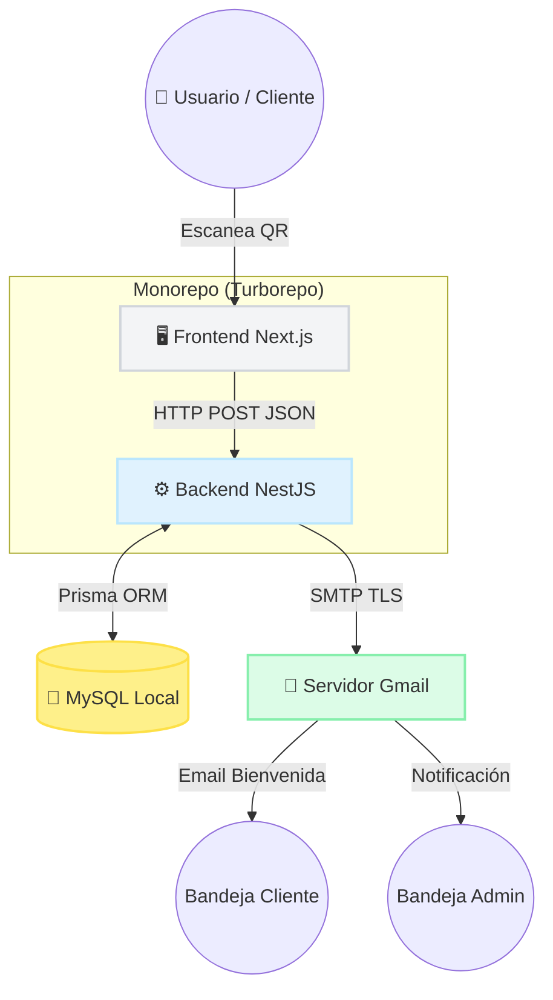
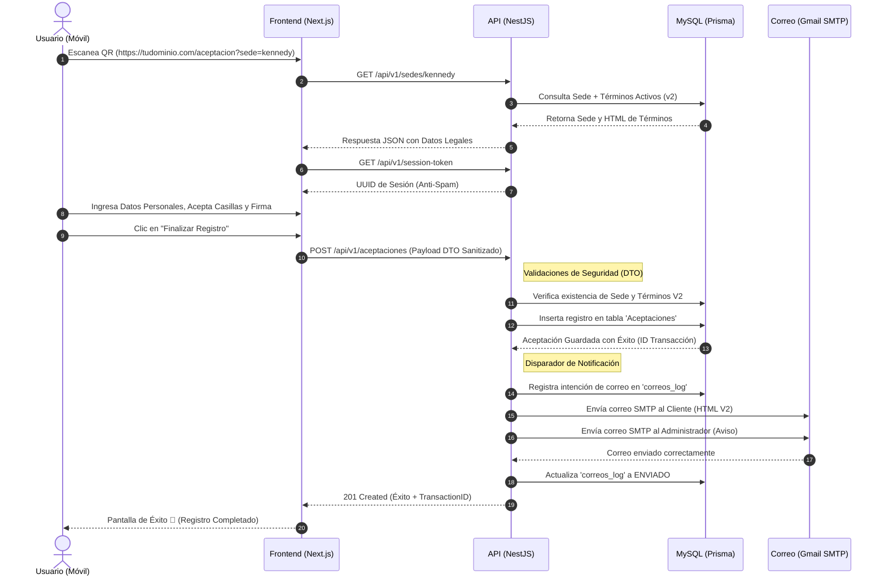
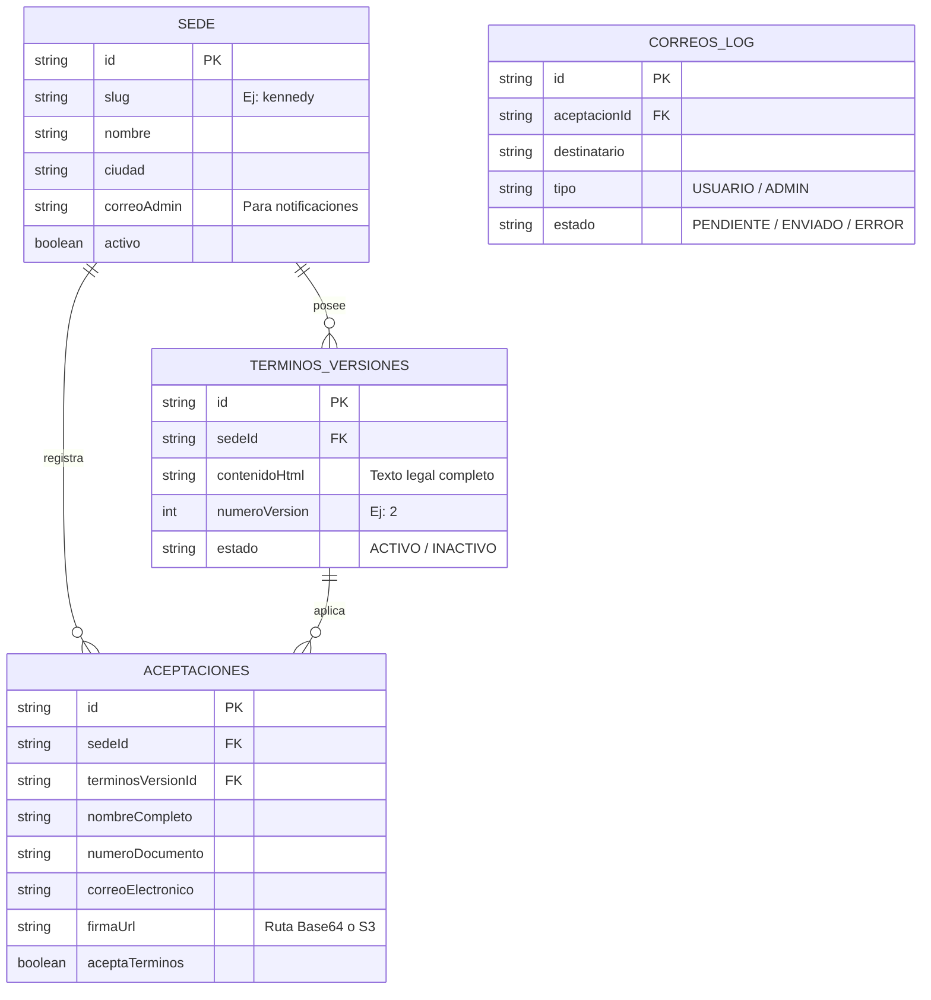
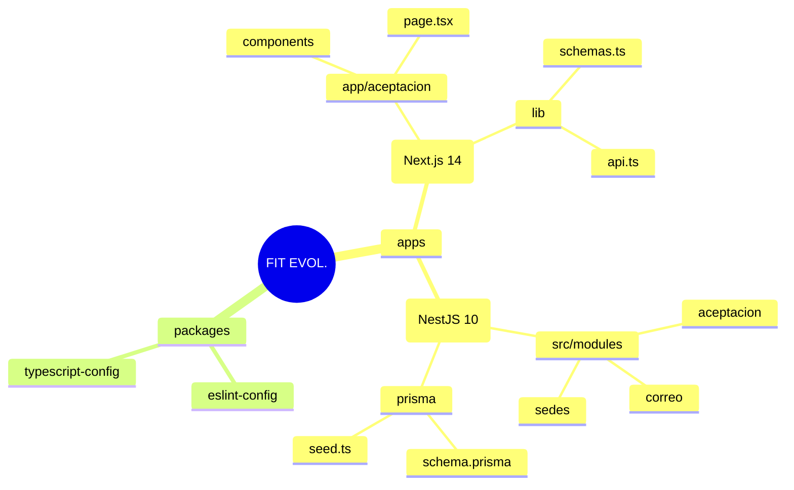

# 🏗️ Arquitectura y Diagramas UML - FIT EVOLUTION360

Este documento contiene la representación visual y técnica del flujo de la plataforma de aceptación digital. Los diagramas están construidos en formato **Mermaid** y pueden ser visualizados nativamente en GitHub, GitLab, o plugins de Markdown.

## 1. Arquitectura del Sistema (Monorepo)

El proyecto utiliza una arquitectura basada en **Turborepo** dividida en dos aplicaciones principales que se comunican a través de una API REST.

---

## 2. Flujo de Aceptación Digital (Sequence Diagram)

El siguiente diagrama de secuencia detalla el proceso paso a paso desde que el usuario escanea el código QR en la recepción del gimnasio hasta que el recibo de términos llega a su bandeja de correo.

---

## 3. Diagrama de Base de Datos (Entity-Relationship)

Estructura relacional simplificada de la base de datos alojada en XAMPP.

---

## 4. Estructura de Proyecto Lógica

El repositorio utiliza **Turborepo** para administrar dependencias cruzadas. La comunicación principal se da entre `apps/web` y `apps/api`.

