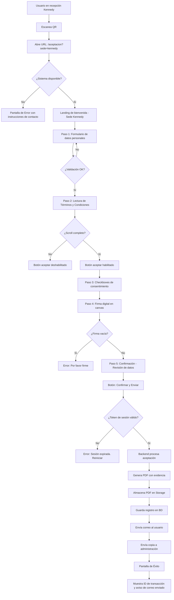
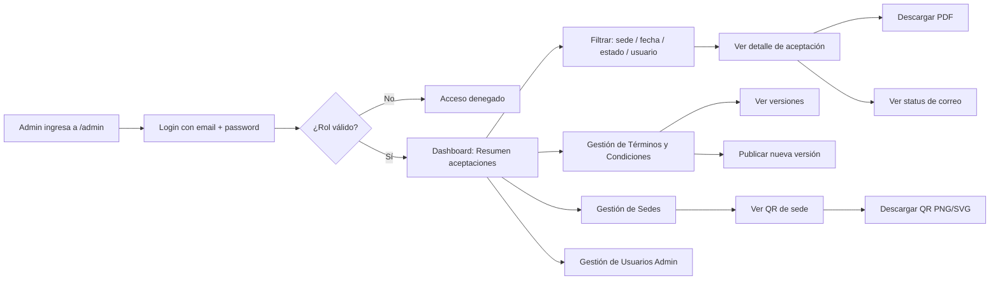
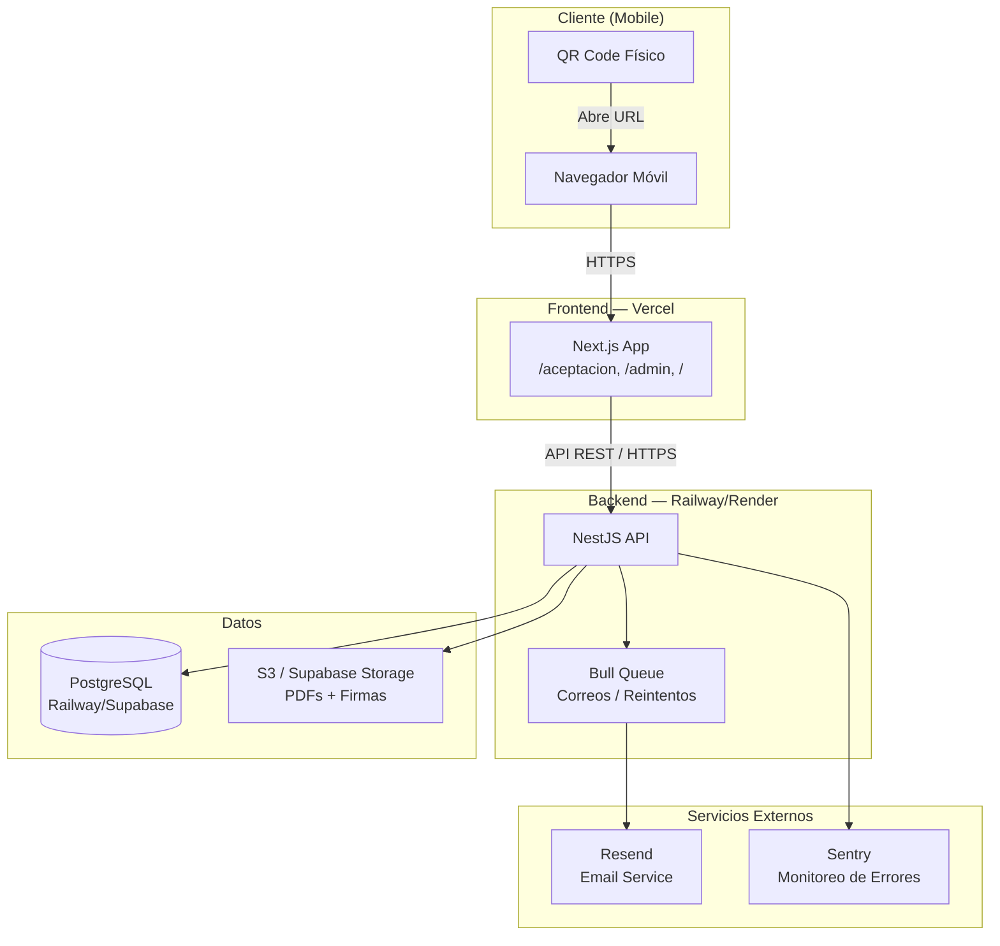
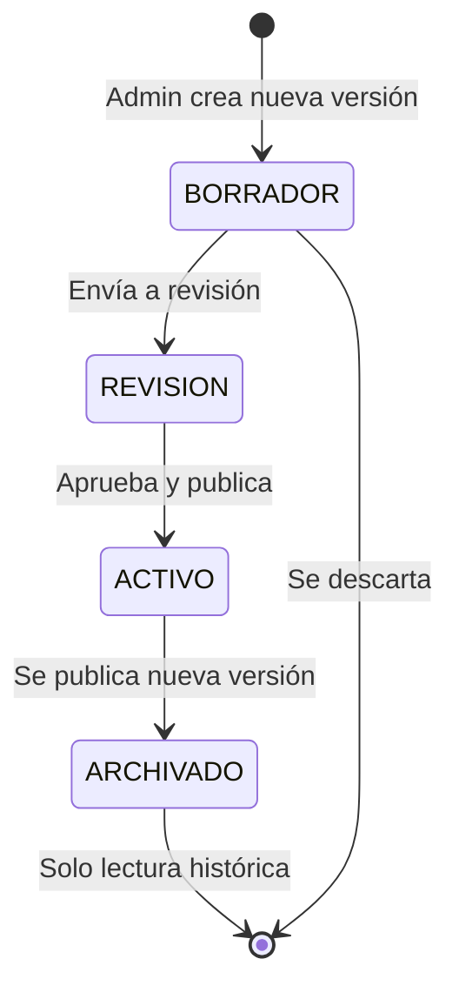
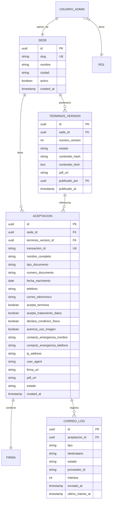
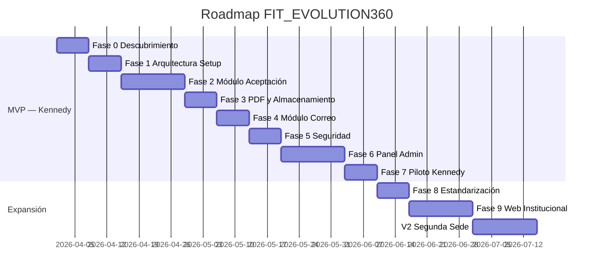

# FIT_EVOLUTION360 — Propuesta Integral de Transformación Digital
**Sede Piloto: Kennedy | Versión: 1.0 | Fecha: 2026-03-23**
**Arquitecto: Senior Fullstack Developer & Solutions Architect**

---

## 1. RESUMEN EJECUTIVO

FIT_EVOLUTION360 requiere la digitalización de sus procesos de consentimiento informado, actualmente realizados en papel, empezando por la sede Kennedy. La solución propuesta es una **plataforma web mobile-first** accesible vía código QR, que permite al usuario final:

1. Acceder al formulario desde su celular escaneando un QR en recepción.
2. Leer la versión vigente de los términos y condiciones.
3. Diligenciar sus datos personales.
4. Firmar digitalmente en el dispositivo.
5. Recibir por correo electrónico el PDF de evidencia de aceptación.

El sistema garantiza **trazabilidad completa, integridad del documento, validez legal mínima** bajo la normativa colombiana (Ley 1581/2012, Decreto 1377/2013) y está diseñado desde el primer día para replicarse en futuras sedes sin reescritura de código.

### Stack Tecnológico Seleccionado

| Capa | Tecnología | Justificación |
|------|-----------|---------------|
| Frontend | Next.js 14 + React + TypeScript | SSR/SSG, rutas dinámicas por sede, SEO institucional |
| Estilos | Tailwind CSS | Velocidad de desarrollo, diseño mobile-first |
| Formularios | React Hook Form + Zod | Validación robusta client-side + type-safety |
| Firma Digital | `react-signature-canvas` | Liviano, canvas nativo, salida en base64/PNG |
| Backend | NestJS + TypeScript | Arquitectura modular, DI, pipes de validación, escalable |
| ORM | Prisma | Type-safe, migraciones, soporta PostgreSQL |
| Base de Datos | PostgreSQL | ACID, soporta JSONB para metadata, robusto |
| PDF | `@react-pdf/renderer` o `pdf-lib` server-side | Generación con metadatos incrustados |
| Correo | **Resend** (MVP) → AWS SES (escala) | Resend: SDK moderno, gratuito hasta 3.000/mes, excelente DX. SES para escala |
| Almacenamiento | Supabase Storage o AWS S3 | PDFs y firmas en almacenamiento seguro con URLs firmadas |
| Autenticación admin | NextAuth.js + JWT | Estándar, fácil de extender con roles |
| Infraestructura | Vercel (frontend) + Railway o Render (backend) | Bajo costo MVP, CI/CD integrado |

> **Recomendación Monorepo vs. Separarado → MONOREPO con Turborepo**
> Para el MVP conviene un monorepo con `apps/web` (Next.js), `apps/api` (NestJS) y `packages/shared` (tipos, validaciones Zod compartidas). Esto reduce fricción en el desarrollo temprano, permite compartir tipos TypeScript (critical para DTOs y formularios), y escala bien. Un monorepo no implica despliegue conjunto — frontend y backend se despliegan de forma independiente.

---

## 2. SUPUESTOS Y DECISIONES TÉCNICAS INICIALES

| # | Supuesto / Decisión | Justificación |
|---|---------------------|---------------|
| 1 | Los términos y condiciones existen en versión PDF/Word y serán entregados por la empresa | Sin este insumo no se puede redactar el contenido digital |
| 2 | El correo corporativo del gimnasio ya existe (ej. admin@fitevolution360.com) | Necesario para el envío de copias |
| 3 | La firma electrónica capturada en canvas es suficiente para el MVP | **Validar con abogado** — en Colombia la firma electrónica simple es válida bajo Ley 527/1999; la firma digital certificada (con entidad certificadora) es más robusta pero costosa |
| 4 | El QR redirige a una URL pública, sin requerir login del usuario final | El usuario nunca crea cuenta; solo registra el evento de aceptación |
| 5 | No se captura biometría (huella dactilar, rostro) en el MVP | Dato sensible que requiere autorización especial. Se descarta para minimización |
| 6 | El formulario de salud/restricciones médicas se limita a declaración jurada del usuario | No se almacena diagnóstico; solo el hecho de que el usuario declara estar apto |
| 7 | El panel administrativo es para uso interno del gimnasio; protegido por login | No es público |
| 8 | El sistema debe soportar múltiples sedes desde el modelo de datos, aunque solo Kennedy esté activa en MVP | Evita migración futura costosa |
| 9 | Cada sede tiene su propio QR; el flujo es idéntico, solo cambia el `sedeId` | El QR codifica la URL con el ID de sede: `https://fitevolution360.com/aceptacion?sede=kennedy` |
| 10 | El versionado de términos es inmutable: una vez publicada una versión, NO se modifica | Solo se crea una nueva versión activa |

---

## 3. REQUERIMIENTOS FUNCIONALES

### RF-001 — Flujo de Aceptación QR
- El sistema debe generar un QR único por sede que redirige a la URL de aceptación correspondiente.
- La landing debe identificar automáticamente la sede desde el parámetro de URL.
- El flujo debe ser 100% completable desde un dispositivo móvil.

### RF-002 — Formulario de Datos Personales
- El sistema debe presentar un formulario con los campos clasificados en la sección 5.
- Todos los campos obligatorios deben validarse antes de permitir avanzar.
- El formulario debe prevenir doble envío (botón deshabilitado tras submit, token único por sesión).

### RF-003 — Presentación de Términos y Condiciones
- El sistema debe mostrar la versión activa y vigente de los términos para la sede.
- El usuario debe hacer scroll hasta el final antes de poder aceptar (UX mínima de evidencia de lectura).
- La versión exacta del documento (hash SHA-256) debe quedar registrada en la base de datos.

### RF-004 — Firma Digital
- El sistema debe presentar un canvas de firma habilitado para touch y mouse.
- El usuario debe dibujar su firma; el sistema no permite avanzar con canvas vacío.
- La firma se almacena como imagen PNG (base64 → archivo) asociada al registro de aceptación.

### RF-005 — Generación de PDF de Evidencia
- El backend debe generar un PDF que incluya: datos del usuario, versión de términos aceptada, timestamp, IP, user-agent, ID de transacción, imagen de la firma, y hash del documento.
- El PDF debe almacenarse en almacenamiento externo seguro (S3/Supabase).
- La URL del PDF debe ser una URL firmada con tiempo de expiración para acceso seguro.

### RF-006 — Envío de Correos
- El sistema debe enviar automáticamente el PDF al correo del usuario y al correo administrativo.
- El sistema debe registrar el estado de entrega de cada correo (enviado, fallido, pendiente).
- En caso de fallo, debe existir un mecanismo de reintento (cola de correos).

### RF-007 — Panel Administrativo
- Los usuarios con rol admin o superior deben poder consultar las aceptaciones por: sede, fecha, estado de correo, nombre, número de documento.
- El panel debe permitir descargar el PDF de cualquier aceptación.
- El panel debe mostrar el estado de cada registro: completo, pendiente envío, error.

### RF-008 — Gestión de Versiones de Términos
- El sistema debe permitir publicar una nueva versión de los términos sin eliminar las anteriores.
- Las aceptaciones existentes deben quedar vinculadas a la versión que estaba activa en el momento.
- Si existe una versión nueva, el sistema debe notificar al administrativo.

### RF-009 — Reaceptación por Cambio de Términos
- Si un usuario que ya aceptó regresa y hay una nueva versión activa, debe realizar el proceso completo nuevamente.
- El sistema debe registrar ambas aceptaciones como eventos independientes, con sus respectivos IDs de transacción.

### RF-010 — Gestión de QR por Sede
- El sistema debe permitir generar y visualizar el QR de cada sede desde el panel administrativo.
- El QR debe ser descargable en alta resolución (PNG/SVG) para impresión.

---

## 4. REQUERIMIENTOS NO FUNCIONALES

| ID | Requerimiento | Métrica |
|----|--------------|---------|
| RNF-001 | Tiempo de carga del formulario (mobile 4G) | < 3 segundos |
| RNF-002 | Disponibilidad del sistema | ≥ 99% uptime mensual |
| RNF-003 | Cifrado de datos en tránsito | TLS 1.2+ obligatorio |
| RNF-004 | Cifrado de datos en reposo (PDFs, firmas) | AES-256 o equivalente en S3 |
| RNF-005 | Rate limiting en endpoint de aceptación | Max 5 req/min por IP |
| RNF-006 | Tiempo de respuesta API (p95) | < 2 segundos |
| RNF-007 | Generación de PDF | < 5 segundos |
| RNF-008 | Soporte móvil | iOS Safari 15+, Chrome Android 90+ |
| RNF-009 | Validación backend independiente del frontend | Siempre, sin excepción |
| RNF-010 | Logs estructurados en producción | JSON, nivel INFO/WARN/ERROR |
| RNF-011 | Backups de base de datos | Diarios, retención 30 días |
| RNF-012 | Tiempo de retención de datos personales | **Validar con abogado** — mínimo 5 años recomendado |

---

## 5. REQUERIMIENTOS LEGALES / OPERATIVOS MÍNIMOS

> ⚠️ Esta sección contiene recomendaciones de cumplimiento normativo colombiano. Los ítems marcados con **[VALIDAR CON ABOGADO]** no son una interpretación definitiva.

| Norma | Aplicación al sistema |
|-------|-----------------------|
| **Ley 1581/2012** (Habeas Data) | Obtener consentimiento previo, expreso e informado para cada tipo de dato personal. Incluir enlace a Política de Tratamiento de Datos. |
| **Decreto 1377/2013** | El consentimiento debe ser específico por finalidad. El formulario debe separar: tratamiento de datos generales, uso de imagen, comunicaciones comerciales. |
| **Ley 527/1999** (Comercio Electrónico) | La firma electrónica es válida si se puede identificar al firmante y detectar cambios posteriores. El sistema cumple esto con IP + timestamp + hash + firma canvas. **[VALIDAR CON ABOGADO]** |
| **Ley 1480/2011** (Estatuto del Consumidor) | El usuario debe poder acceder a información clara sobre el servicio antes de aceptar. |
| **GDPR (no aplica directamente)** | Si en el futuro hay usuarios extranjeros, considerar adecuación. Por ahora no es obligatorio. |

### Evidencias Mínimas de Aceptación (Obligatorias)

El sistema debe registrar **como mínimo**:

- ✅ Fecha y hora UTC + zona horaria local (timestamp ISO 8601)
- ✅ Versión exacta del documento aceptado (hash SHA-256 del contenido)
- ✅ ID de transacción único (UUID v4)
- ✅ Dirección IP del cliente
- ✅ User-Agent del navegador
- ✅ Imagen de la firma capturada
- ✅ Correo electrónico del usuario que aceptó
- ✅ Número de documento de identidad
- ✅ URL del PDF generado y almacenado
- ✅ Estado de entrega del correo (enviado/fallido)
- ✅ ID de la sede donde se realizó la aceptación

---

## 6. CAMPOS DEL FORMULARIO — CLASIFICACIÓN Y VALIDACIONES

### 6.1 Campos Obligatorios (MVP)

| Campo | Tipo | Validación | Justificación |
|-------|------|-----------|---------------|
| `nombre_completo` | texto | Min 5 chars, solo letras y espacios | Identificación del titular |
| `tipo_documento` | select | Valores: CC, CE, PA, TI | Clasificación legal |
| `numero_documento` | texto | Solo números, 5-12 dígitos | Identificación única |
| `fecha_nacimiento` | date | Min 16 años, max 100 años | Verificar mayoría de edad o guarda |
| `telefono` | texto | Formato colombiano 10 dígitos | Contacto de emergencia base |
| `correo_electronico` | email | Formato RFC, MX validation light | Envío de copia del PDF |
| `correo_confirmar` | email | Debe coincidir con `correo_electronico` | Prevenir errores de digitación |
| `acepta_terminos` | checkbox | Debe ser `true` | Consentimiento global |
| `acepta_tratamiento_datos` | checkbox | Debe ser `true` | Ley 1581 — obligatorio |
| `declara_condicion_fisica` | checkbox | Debe ser `true` | Consentimiento informado actividad física |
| `firma_digital` | canvas/base64 | Canvas no vacío (píxeles != fondo) | Validez de la aceptación |

### 6.2 Campos Opcionales (Recomendados MVP)

| Campo | Tipo | Validación | Justificación |
|-------|------|-----------|---------------|
| `autoriza_uso_imagen` | checkbox | Boolean, default false | Uso en redes/marketing — debe ser opt-in |
| `contacto_emergencia_nombre` | texto | Min 3 chars | Operativo en caso de accidente |
| `contacto_emergencia_telefono` | texto | 10 dígitos | Operativo en caso de accidente |
| `autoriza_comunicaciones` | checkbox | Boolean, default false | Newsletter/promos — opt-in separado |

### 6.3 Campos que NO deben pedirse en MVP

| Campo | Razón |
|-------|-------|
| Dirección residencial completa | Dato innecesario para el proceso; riesgo de privacidad |
| Datos de salud específicos (enfermedades, diagnósticos) | Dato sensible (Art. 5 Ley 1581). Solo declaración jurada genérica |
| Número de tarjeta / datos de pago | Fuera del alcance del MVP |
| Fotografía/selfie de identidad | Dato sensible; requiere justificación especial **[VALIDAR CON ABOGADO]** |
| Huella dactilar | Biometría — dato sensible categoría especial |
| Peso / talla / IMC | Dato de salud sensible. No en MVP |

### 6.4 Campos de Trazabilidad Técnica (Automáticos — No visibles al usuario)

| Campo | Fuente | Descripción |
|-------|--------|-------------|
| `ip_address` | `X-Forwarded-For` / `req.ip` | IP del dispositivo cliente |
| `user_agent` | Header HTTP | Navegador y sistema operativo |
| `sede_id` | Parámetro URL / QR | Identificador de sede |
| `terminos_version_id` | BD — versión activa al momento | FK a la versión del documento |
| `transaction_id` | UUID v4 generado en backend | Identificador único de la aceptación |
| `timestamp_inicio` | Servidor | Cuándo inició el formulario |
| `timestamp_firma` | Servidor | Cuándo se realizó el submit |
| `documento_hash` | SHA-256 del contenido del documento | Integridad del documento aceptado |
| `pdf_url` | Storage | URL del PDF generado |
| `email_status` | Resend/SES webhook | Estado de entrega del correo |

> **Datos Sensibles Identificados:**
> - `declara_condicion_fisica`: Aunque es solo una declaración, hace referencia a condición de salud. Tratar con cifrado adicional. **[VALIDAR CON ABOGADO]**
> - `firma_digital`: Dato biométrico indirecto. Almacenar cifrado. **[VALIDAR CON ABOGADO]**
> - `fecha_nacimiento`: Dato que permite calcular edad; tratar con cuidado.

---

## 7. USER FLOW COMPLETO

### 7.1 Flujo del Usuario Final



### 7.2 Manejo de Casos Borde y Errores

| Escenario | Comportamiento del Sistema |
|-----------|--------------------------|
| Usuario abandona el proceso | El registro queda en estado `incompleto` en BD; se elimina tras 24h por job de limpieza |
| Correo mal escrito | Validación dual (client + server). El correo de entrega falla → status `email_failed`; la aceptación queda registrada igualmente |
| Firma vacía | Frontend bloquea; backend rechaza con HTTP 400 si llega vacía igualmente |
| Doble envío (doble click) | Token único de sesión (UUID por formulario). El backend rechaza el segundo request con HTTP 409 |
| Falla del servicio de correo | La aceptación se guarda. El correo queda en cola para reintento. El usuario ve pantalla de éxito pero con aviso de correo pendiente |
| Caída del backend | Pantalla de error amigable con código de referencia. El frontend no pierde los datos ingresados (localStorage temporal) |
| Cambio de versión de términos | Si hay nueva versión activa, el sistema la carga automáticamente. La versión anterior queda archivada |
| Usuario acepta varias veces | Se permiten múltiples aceptaciones (el usuario puede reingresar al gimnasio, puede cambiar la versión). Cada aceptación es un registro independiente. El admin puede consultar el historial |
| Dispositivo sin soporte canvas | Se muestra un mensaje indicando el requisito mínimo del navegador |

### 7.3 Flujo Administrativo



### 7.4 Roles y Permisos

| Rol | Descripción | Permisos |
|-----|------------|---------|
| `superadmin` | Dueño / Socio de la empresa | Todo + gestión de admins, sedes, términos |
| `admin_sede` | Administrador de una sede específica | Ver aceptaciones de su sede, descargar PDFs, generar QR |
| `recepcionista` | Rol de solo lectura por sede | Ver si una persona aceptó; NO puede ver datos completos |
| `auditor` | Rol externo de cumplimiento | Ver y exportar aceptaciones; sin modificar |

```
Modelo de permisos (RBAC simple):

PERMISO                     superadmin  admin_sede  recepcionista  auditor
ver_aceptaciones_propia_sede    ✅          ✅           ✅ (parcial)  ✅
ver_aceptaciones_todas_sedes    ✅          ❌            ❌           ✅
descargar_pdf                   ✅          ✅            ❌           ✅
publicar_terminos               ✅          ❌            ❌           ❌
gestionar_sedes                 ✅          ❌            ❌           ❌
gestionar_usuarios_admin        ✅          ❌            ❌           ❌
exportar_reporte                ✅          ✅            ❌           ✅
ver_logs_auditoria              ✅          ❌            ❌           ✅
```

---

## 8. ARQUITECTURA DEL SISTEMA

### 8.1 Arquitectura General



### 8.2 Estructura de Módulos NestJS (Backend)

```
src/
├── modules/
│   ├── aceptacion/          # Flujo central de aceptación
│   │   ├── aceptacion.controller.ts
│   │   ├── aceptacion.service.ts
│   │   ├── aceptacion.module.ts
│   │   └── dto/
│   ├── terminos/            # Gestión de versiones de T&C
│   │   ├── terminos.controller.ts
│   │   ├── terminos.service.ts
│   │   └── terminos.module.ts
│   ├── sedes/               # Gestión de sedes y QR
│   ├── correo/              # Servicio de envío y cola
│   ├── pdf/                 # Generación de PDFs
│   ├── storage/             # Abstracción S3/Supabase
│   ├── auth/                # JWT, Guards, Roles
│   ├── usuarios-admin/      # Gestión de admins
│   └── auditoria/           # Logs de acciones admin
├── common/
│   ├── guards/
│   ├── interceptors/
│   ├── filters/
│   └── decorators/
├── config/                  # Variables de entorno tipadas
└── prisma/                  # Prisma service singleton
```

### 8.3 Estructura Monorepo

```
fit-evolution360/
├── apps/
│   ├── web/                 # Next.js Frontend
│   │   ├── app/
│   │   │   ├── aceptacion/
│   │   │   │   └── [sede]/page.tsx
│   │   │   ├── admin/
│   │   │   │   ├── dashboard/page.tsx
│   │   │   │   ├── aceptaciones/page.tsx
│   │   │   │   ├── terminos/page.tsx
│   │   │   │   └── sedes/page.tsx
│   │   │   ├── (institucional)/
│   │   │   │   ├── page.tsx         # Home
│   │   │   │   ├── nosotros/page.tsx
│   │   │   │   ├── sedes/page.tsx
│   │   │   │   ├── servicios/page.tsx
│   │   │   │   └── contacto/page.tsx
│   │   │   └── layout.tsx
│   │   ├── components/
│   │   ├── hooks/
│   │   └── lib/
│   └── api/                 # NestJS Backend
│       ├── src/
│       └── prisma/
├── packages/
│   └── shared/              # Tipos y esquemas Zod compartidos
│       ├── types/
│       └── schemas/
├── docs/                    # Documentación técnica
│   ├── arquitectura.md
│   ├── api.md
│   └── legal/
├── turbo.json
└── package.json
```

### 8.4 Estrategia de Versionado de Términos



- Solo puede haber **una versión ACTIVO** por sede (o global).
- Las versiones archivadas son **inmutables** — nunca se modifican.
- El hash SHA-256 del contenido se calcula al momento de publicación.
- Las aceptaciones existentes quedan vinculadas al `terminos_version_id` → integridad histórica garantizada.

### 8.5 Estrategia de QR por Sede

- URL del QR: `https://app.fitevolution360.com/aceptacion?sede={slug_sede}&v={qr_version}`
- El `slug_sede` identifica la sede (ej. `kennedy`, `bosa`, `soacha`).
- El parámetro `v` puede usarse para invalidar QRs viejos si es necesario.
- El backend valida que la sede exista y esté activa.
- El QR se genera con `qrcode` (biblioteca npm) en el backend; el admin lo descarga desde el panel.
- **El QR físico está impreso y plastificado en recepción** — el sistema no cambia la URL del QR, solo el contenido que carga.

---

## 9. MODELO DE DATOS / BASE DE DATOS

> Ver archivo separado: `db_schema.md` con el esquema Prisma completo.

### Resumen Entidades Principales



---

## 10. ENDPOINTS API

### 10.1 Flujo Público (Sin autenticación)

#### `GET /api/v1/sedes/:slug`
Retorna información de la sede para poblar la landing y validar que existe.
```json
// Response 200
{
  "id": "uuid",
  "slug": "kennedy",
  "nombre": "FIT EVOLUTION360 - Sede Kennedy",
  "terminosActivos": {
    "id": "uuid",
    "numeroVersion": 3,
    "contenidoHtml": "<p>...</p>",
    "contenidoHash": "sha256:abc123...",
    "publicadoAt": "2026-01-15T00:00:00Z"
  }
}
```

#### `POST /api/v1/aceptaciones`
Recibe el formulario completo con la firma en base64.
```json
// Request Body
{
  "sedeId": "uuid",
  "terminosVersionId": "uuid",
  "formulario": {
    "nombreCompleto": "Juan Pérez López",
    "tipoDocumento": "CC",
    "numeroDocumento": "1020304050",
    "fechaNacimiento": "1990-05-20",
    "telefono": "3001234567",
    "correoElectronico": "juan@email.com",
    "aceptaTerminos": true,
    "aceptaTratamientoDatos": true,
    "declaraCondicionFisica": true,
    "autorizaUsoImagen": false,
    "contactoEmergenciaNombre": "María López",
    "contactoEmergenciaTelefono": "3109876543"
  },
  "firmaBase64": "data:image/png;base64,iVBOR...",
  "sessionToken": "uuid-token-sesion"
}

// Response 201
{
  "transactionId": "550e8400-e29b-41d4-a716-446655440000",
  "mensaje": "Aceptación registrada exitosamente. Recibirás una copia por correo.",
  "correoEnviado": true
}

// Response 409 (doble envío)
{ "error": "Esta sesión ya fue procesada." }

// Response 400 (firma vacía)
{ "error": "La firma digital es requerida." }
```

#### `GET /api/v1/session-token`
Genera un token único de sesión para prevenir doble envío (llamado al cargar el formulario).
```json
{ "sessionToken": "uuid" }
```

### 10.2 Panel Administrativo (Requiere JWT)

#### `POST /api/v1/auth/login`
```json
// Request
{ "email": "admin@fitevolution360.com", "password": "..." }
// Response
{ "accessToken": "jwt...", "refreshToken": "jwt..." }
```

#### `GET /api/v1/admin/aceptaciones`
Con query params: `?sedeId=&fechaDesde=&fechaHasta=&estado=&buscar=&page=1&limit=20`
```json
{
  "data": [{ ... }],
  "total": 120,
  "page": 1,
  "lastPage": 6
}
```

#### `GET /api/v1/admin/aceptaciones/:id`
Detalle completo de una aceptación.

#### `GET /api/v1/admin/aceptaciones/:id/pdf`
Retorna URL firmada del PDF para descarga (expira en 1 hora).

#### `GET /api/v1/admin/sedes/:id/qr`
Genera y retorna el QR en base64 PNG y SVG.

#### `GET /api/v1/admin/terminos`
Lista todas las versiones de términos por sede.

#### `POST /api/v1/admin/terminos`
Crea nueva versión (estado: `BORRADOR`).

#### `PATCH /api/v1/admin/terminos/:id/publicar`
Publica una versión (la activa pasa a `ARCHIVADO`, la nueva pasa a `ACTIVO`).

#### `GET /api/v1/admin/dashboard`
```json
{
  "totalAceptacionesHoy": 12,
  "totalAceptacionesMes": 187,
  "totalAceptacionesHistorico": 1043,
  "aceptacionesPorSede": [
    { "sede": "Kennedy", "total": 1043 }
  ],
  "erroresCorreoUltimas24h": 2,
  "versionTerminosActiva": 3
}
```

### 10.3 Manejo de Errores — Formato Estándar

```json
{
  "statusCode": 400,
  "error": "Bad Request",
  "message": "La firma digital es requerida",
  "timestamp": "2026-03-23T20:00:00Z",
  "path": "/api/v1/aceptaciones"
}
```

### 10.4 Headers de Seguridad Requeridos

```
Content-Security-Policy: default-src 'self'
X-Content-Type-Options: nosniff
X-Frame-Options: DENY
Strict-Transport-Security: max-age=31536000; includeSubDomains
Referrer-Policy: strict-origin-when-cross-origin
```

---

## 11. PLAN DE DESARROLLO POR FASES

### FASE 0 — Descubrimiento (1 semana)
**Objetivo:** Recolectar insumos legales y operativos reales.
**Tareas:**
- Reunión con administración del gimnasio.
- Recolección del documento de T&C existente (Word/PDF).
- Definición de correos corporativos.
- Definición del flujo de recepción.
- Responder las preguntas abiertas (ver Sección 16).

**Entregables:** Documento de requerimientos aprobado, T&C en formato texto estructurado.
**Criterio de aceptación:** Administración aprueba el documento de requerimientos por escrito.

---

### FASE 1 — Arquitectura y Setup (1 semana)
**Objetivo:** Preparar el entorno de desarrollo y la estructura del proyecto.
**Tareas:**
- Crear monorepo con Turborepo.
- Configurar Next.js, NestJS, Prisma, PostgreSQL local.
- Configurar ESLint, Prettier, Husky, commitlint.
- Configurar entornos: `.env.development`, `.env.production`.
- Crear primer esquema de base de datos y migraciones iniciales.
- Configurar despliegue en Vercel (frontend) y Railway (backend).

**Entregables:** Repositorio base funcional, CI/CD básico, README.
**Riesgos:** Configuración de PostgreSQL en producción puede tomar más de lo esperado.
**Criterio:** `npm run dev` funciona en todos los packages del monorepo.

---

### FASE 2 — Módulo de Aceptación (2 semanas)
**Objetivo:** Implementar el flujo completo de aceptación del usuario final.
**Tareas:**
- Componente `SessionToken`: solicita token al cargar formulario.
- Paso 1: Formulario con React Hook Form + Zod.
- Paso 2: Visualizador de T&C con scroll tracking.
- Paso 3: Checkboxes de consentimiento.
- Paso 4: Canvas de firma (`react-signature-canvas`).
- Paso 5: Revisión y confirmación.
- Endpoint `POST /api/v1/aceptaciones` con toda la lógica de validación.
- Landing de éxito y manejo de errores.

**Entregables:** Flujo completo funcional en dev con datos de prueba.
**Riesgos:** UX del canvas en móvil puede requerir iteraciones. Validar en iOS Safari.
**Criterio:** El flujo completo se puede ejecutar end-to-end en móvil sin errores.

---

### FASE 3 — PDF y Almacenamiento (1 semana)
**Objetivo:** Generar PDF de evidencia y almacenarlo de forma segura.
**Tareas:**
- Servicio `PdfService` con `pdf-lib` o `@react-pdf/renderer` en servidor.
- Diseño del PDF de evidencia (layout profesional con logo, datos, firma, metadatos).
- Integración con Supabase Storage o S3 para subida y URL firmada.
- Hash SHA-256 del documento de términos.

**Entregables:** PDF generado y almacenado con URL accesible.
**Riesgos:** Latencia de generación de PDF si el servidor tiene recursos limitados.
**Criterio:** PDF descargable, legible, con todos los metadatos y firma visible.

---

### FASE 4 — Módulo de Correo (1 semana)
**Objetivo:** Automatizar el envío de PDFs por correo.
**Tareas:**
- Configurar Resend SDK.
- Template HTML de correo para usuario (profesional, con logo).
- Template HTML de correo para administración.
- Queue con Bull para reintentos en caso de fallo.
- Registro de estado en tabla `correo_log`.
- Webhook de Resend para actualizar estado de entrega.

**Entregables:** Correos enviados automáticamente con PDF adjunto.
**Riesgos:** Correos pueden caer en spam si el dominio no está verificado en Resend.
**Criterio:** Correo recibido en bandeja principal de Gmail/Outlook con PDF adjunto.

---

### FASE 5 — Seguridad y Auditoría (1 semana)
**Objetivo:** Endurecer la seguridad del sistema.
**Tareas:**
- Rate limiting con `@nestjs/throttler`.
- Helmet.js para headers HTTP seguros.
- Validación de CORS restrictiva.
- Cifrado de datos sensibles en BD (firma URL, correo).
- Implementar logging estructurado con Winston o Pino.
- Revisar OWASP Top 10 aplicable al flujo.

**Entregables:** Reporte de seguridad básico, logs funcionando.
**Criterio:** Pruebas de penetración básicas (OWASP ZAP) sin vulnerabilidades críticas.

---

### FASE 6 — Panel Administrativo (2 semanas)
**Objetivo:** Panel para consulta y gestión de aceptaciones.
**Tareas:**
- Login administrativo con NextAuth.js.
- Dashboard con métricas básicas.
- Tabla de aceptaciones con filtros (sede, fecha, estado, buscar).
- Vista de detalle de aceptación.
- Descarga de PDF.
- Gestión de versiones de T&C (crear borrador, publicar).
- Generación y descarga de QR por sede.

**Entregables:** Panel funcional, protegido, con roles implementados.
**Riesgos:** Scope creep en el panel — priorizar funcionalidad mínima viable.
**Criterio:** Un admin puede consultar y descargar cualquier aceptación en < 3 clics.

---

### FASE 7 — Piloto Sede Kennedy (1 semana)
**Objetivo:** Despliegue en producción y prueba real en recepción.
**Tareas:**
- Despliegue en Vercel + Railway producción.
- Carga del T&C real aprobado por la administración.
- Impresión del QR y prueba física en recepción.
- Pruebas con 5-10 usuarios reales (staff del gimnasio primero).
- Monitoreo con Sentry.
- Ajustes finales de UX.

**Entregables:** Sistema en producción funcionando en sede Kennedy.
**Criterio:** 20 aceptaciones reales sin errores técnicos.

---

### FASE 8 — Ajustes y Estandarización Multisede (1 semana)
**Objetivo:** Preparar la infraestructura para replicar en nuevas sedes.
**Tareas:**
- Documentar el proceso de alta de nueva sede (runbook).
- Implementar UI para crear nueva sede desde el panel admin.
- Validar que el QR y los T&C se puedan gestionar por sede independientemente.
- Pruebas de regresión.

**Entregables:** Runbook de alta de sede, segunda sede creada en staging como prueba.
**Criterio:** Una nueva sede puede estar lista en < 30 minutos operativos.

---

### FASE 9 — Web Institucional Base (2 semanas)
**Objetivo:** Lanzar la página pública de FIT_EVOLUTION360.
**Tareas:**
- Diseño y maquetación de todas las páginas del sitemap (ver Sección 11).
- Integrar con CMS headless (Sanity.io o Contentful) para gestión de contenido.
- SEO básico: meta tags, sitemap.xml, robots.txt.
- Formulario de contacto.
- Integración de Google Analytics o Plausible.

**Entregables:** Sitio institucional publicado en dominio de FIT_EVOLUTION360.
**Criterio:** Todas las páginas del sitemap accesibles, mobile-first, PageSpeed > 85.

---

## 12. SITEMAP INSTITUCIONAL

```
fitevolution360.com/
├── / (Inicio)
│   ├── Hero + CTA principal
│   ├── Resumen de servicios
│   ├── Sedes (mapa)
│   └── Testimonios
├── /nosotros
│   ├── Historia
│   ├── Misión, Visión, Valores
│   └── Equipo
├── /sedes
│   ├── /sedes/kennedy
│   │   ├── Información, horarios, ubicación
│   │   └── CTA: Aceptar Términos (QR o link)
│   └── /sedes/[nueva-sede] (escalable)
├── /servicios
│   ├── Cardio y máquinas
│   ├── Clases grupales
│   ├── Entrenamiento personalizado
│   └── Planes y membresías
├── /reglamentos
│   └── Reglamento interno por sede
├── /terminos-y-condiciones
│   └── Versión actual vigente (pública, solo lectura)
├── /politica-de-datos
│   └── Política completa Ley 1581
├── /preguntas-frecuentes
├── /contacto
│   ├── Formulario
│   └── Ubicaciones
└── /aceptacion (APP — Mobile First)
    └── /aceptacion?sede=kennedy
```

**Páginas públicas:** Todo excepto `/admin/*` y `/aceptacion` (que debe funcionar sin login pero es un flujo guiado).

**Páginas con acceso administrativo:** `/admin/*` — protegidas con JWT + RBAC.

**Componentes reutilizables propuestos:**
- `<SedeCard />` — tarjeta de sede
- `<TermsViewer />` — visor de T&C con scroll tracking
- `<SignatureCanvas />` — canvas de firma
- `<StepIndicator />` — indicador de progreso del formulario
- `<QRCode />` — generador y visualizador de QR
- `<AcceptancesTable />` — tabla del panel admin con filtros
- `<EmailStatusBadge />` — badge de estado de correo

---

## 13. PLAN DE PRUEBAS — PILOTO SEDE KENNEDY

### 13.1 Pruebas Funcionales

| ID | Caso de Prueba | Criterio de Éxito |
|----|---------------|-------------------|
| PF-01 | Escanear QR con iOS Safari → formulario carga | Carga en < 3s, sin errores |
| PF-02 | Escanear QR con Android Chrome → formulario carga | Carga en < 3s, sin errores |
| PF-03 | Enviar formulario con campos vacíos | Muestra errores de validación por campo |
| PF-04 | Enviar formulario con correo inválido | Error específico en campo correo |
| PF-05 | Intentar aceptar sin hacer scroll completo | Botón aceptar deshabilitado |
| PF-06 | Intentar enviar con firma vacía | Error: "Por favor firme" |
| PF-07 | Flujo completo exitoso | PDF generado, correos enviados, pantalla éxito |
| PF-08 | Doble click en botón enviar | Solo se procesa una vez (HTTP 409 en segundo intento) |
| PF-09 | Correo de usuario recibe PDF legible | PDF abre correctamente, firma visible |
| PF-10 | Correo admin recibe copia | Correo admin recibe copia idéntica |
| PF-11 | Admin puede consultar aceptación recién creada | Aparece en panel en < 30s |
| PF-12 | Admin descarga PDF desde panel | URL firmada funciona, PDF idéntico |

### 13.2 Pruebas de Seguridad

| ID | Caso | Criterio |
|----|------|---------|
| PS-01 | Enviar payload con XSS en nombre | Backend sanitiza, no ejecuta script |
| PS-02 | SQL Injection en número documento | Prisma previene; error genérico al usuario |
| PS-03 | Acceder a `/admin` sin login | Redirige a `/admin/login` |
| PS-04 | Usar JWT de otro usuario | HTTP 403 |
| PS-05 | Rate limit: 10 envíos en 1 minuto desde misma IP | Bloqueo tras 5 intentos |
| PS-06 | Acceder a PDF de otra aceptación sin permiso | HTTP 403 |

### 13.3 Pruebas Móviles

- Probar en: iPhone 12 (iOS 15), Samsung Galaxy A (Android 12), dispositivos con pantalla < 5.5"
- Verificar que el canvas de firma funciona con dedo (no solo mouse).
- Verificar que el scroll en el visor de T&C funciona normalmente.
- Verificar que el teclado virtual no rompe el layout.

### 13.4 Pruebas de Carga

- **Herramienta:** k6 o Artillery
- **Escenario:** 50 usuarios concurrentes completando el flujo en < 5 minutos
- **Criterio:** Sin degradación de performance, tiempo respuesta API < 2s en p95

### 13.5 Plan Post-Piloto

1. Recolectar feedback de recepcionistas (¿usuarios tienen dificultades?).
2. Revisar logs de errores en Sentry durante la primera semana.
3. Verificar tasa de correos fallidos.
4. Evaluar si el flujo de 5 pasos es demasiado largo (posible simplificación UX).
5. Iterar en los próximos 7 días antes de declarar el piloto exitoso.

---

## 14. SEGURIDAD Y CUMPLIMIENTO

### 14.1 Medidas de Seguridad

| Capa | Medida | Implementación |
|------|--------|---------------|
| Transporte | TLS 1.2+ obligatorio | Vercel / Railway proveen HTTPS automático |
| Aplicación | Helmet.js (headers HTTP) | `app.use(helmet())` en NestJS |
| Aplicación | CORS restrictivo | Solo permitir origen del frontend |
| Aplicación | Rate limiting | `@nestjs/throttler` — 5 req/min en endpoint público |
| Aplicación | Validación de entrada | Pipes de NestJS + Zod en frontend |
| Datos | Cifrado en reposo | S3/Supabase con SSE-S3 o SSE-KMS |
| Datos | Datos sensibles en BD | Email encriptado con pgcrypto o nivel aplicación |
| Autenticación | JWT corto plazo | Access token 15min, refresh token 7 días |
| Autenticación | bcrypt para passwords admin | rounds: 12 |
| Auditoría | Logs de acciones admin | Tabla `auditoria_log` en BD |
| Monitoreo | Alertas de errores | Sentry en frontend y backend |

### 14.2 Retención y Eliminación de Datos

> **[VALIDAR CON ABOGADO]** — La retención mínima recomendada para documentos de consentimiento informado en Colombia es de **5 años** desde la última relación con el titular. El sistema debe implementar:

- Soft delete para registros (campo `deleted_at`).
- Política de retención configurable por sede.
- Proceso documentado para atender derechos ARCO (Acceso, Rectificación, Cancelación, Oposición).

### 14.3 Estrategia de Backups

- Base de datos: Backup automático diario (Railway/Supabase lo proveen). Retención 30 días.
- Storage S3: Versionado habilitado. Replicación a región secundaria si el presupuesto lo permite.
- En caso de desastre: RTO < 4 horas, RPO < 24 horas (objetivo MVP).

---

## 15. ROADMAP MVP → MULTISEDE



### MVP (V1) — Entra sí o sí:
- ✅ Flujo de aceptación QR → formulario → firma → PDF → correo
- ✅ Versionado de T&C
- ✅ Almacenamiento seguro de evidencias
- ✅ Panel admin básico (consultar, descargar)
- ✅ Sede Kennedy activa
- ✅ Roles: superadmin, admin_sede

### V2 — Próximas sedes + mejoras:
- Segunda sede (Bosa, Soacha, etc.)
- Dashboard con gráficas avanzadas
- Notificaciones automáticas cuando T&C cambian (correo a admin)
- Exportación de reportes en Excel/CSV
- Integración con sistema de membresías
- Roles: recepcionista, auditor
- Firma electrónica certificada (si lo requiere el abogado)

### V3 — Plataforma completa:
- App móvil nativa (React Native)
- CRM básico de clientes
- Integración con pasarela de pagos
- Web institucional con CMS
- API pública documentada

---

## 16. PREGUNTAS ABIERTAS PARA LA ADMINISTRACIÓN

> Estas preguntas deben responderse en la Fase 0 antes de iniciar el desarrollo.

1. ¿Cuál es el correo corporativo que recibirá las copias de aceptaciones? ¿Es uno solo o uno por sede?
2. ¿Tienen dominio web propio (fitevolution360.com)? ¿Está disponible el acceso DNS?
3. ¿Cuentan con los términos y condiciones en formato Word/PDF listo para entregar al equipo técnico?
4. ¿Los términos aplican igual para todas las modalidades (cardio, clases, personal) o cambian por servicio?
5. ¿Existe ya una política de tratamiento de datos personales redactada? ¿Está registrada ante la SIC?
6. ¿Se va a requerir que menores de 18 años puedan aceptar? Si sí, ¿quién firma por ellos?
7. ¿Cuántas personas tendrán acceso al panel administrativo? ¿Cuáles son sus roles?
8. ¿Existe algún sistema de membresías o software de gestión actual? ¿Se requiere integración?
9. ¿El gimnasio tiene proveedor de hosting o prefieren que el equipo técnico lo gestione?
10. ¿Entienden que la firma en canvas es firma electrónica simple, no firma digital certificada? ¿Se requiere mayor nivel de validez legal? **[VALIDAR CON ABOGADO]**
11. ¿Cuántos usuarios aproximados por día se esperan en la sede Kennedy en pico?
12. ¿Se requiere que el sistema envíe recordatorios de reaceptación cuando cambien los T&C a usuarios ya registrados?
13. ¿Los reglamentos por sede son diferentes a los términos y condiciones generales, o son el mismo documento?
14. ¿La autorización de uso de imagen debe ser un campo opcional u obligatorio?
15. ¿Cuál es el presupuesto estimado para infraestructura mensual? (esto define si usamos tier gratuito o pagos de Vercel, Railway, Supabase, Resend)
