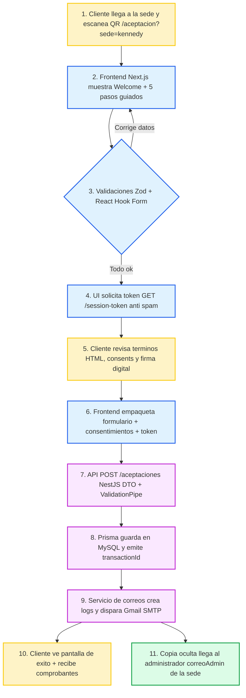

# Diagrama 1: Flujo del Usuario

El recorrido refleja el flujo real del onboarding digital implementado en `apps/web/app/aceptacion/page.tsx`: el recepcionista entrega un QR, el cliente atraviesa los 5 pasos guiados en Next.js 14 y la API NestJS valida cada entrega antes de almacenar y notificar.

## Resumen operativo
- El frontend (Next.js + Tailwind) es 100% mobile-first y controla el avance desde el componente `AceptacionContent`.
- Zod y React Hook Form se encargan de validar y mostrar errores en tiempo real antes de permitir el avance.
- Cada envio necesita un token emitido por `SessionTokenService` para evitar doble submit y spam.
- La API `POST /api/v1/aceptaciones` inserta con Prisma y dispara correos reales mediante `CorreoService`.

## Imagen renderizada

## Narrativa paso a paso
1. Cliente llega a la sede y escanea `https://.../aceptacion?sede=kennedy` desde el counter.
2. Next.js muestra la pantalla de bienvenida y luego los pasos Datos > Terminos > Consents > Firma > Confirmacion.
3. Cada paso valida con Zod; los errores regresan a la misma vista hasta corregirlos.
4. Antes de enviar, el frontend solicita `GET /api/v1/session-token` (anti double submit) y empaqueta formulario, consentimientos y firma (`firmaBase64`).
5. El backend verifica sede activa, version de terminos `estado=ACTIVO`, compara correos y recalcula el hash del HTML legal.
6. Prisma crea el registro en `aceptaciones`, deja evidencias (transactionId, hash, metadata tecnica) y genera logs en `correos_log`.
7. `CorreoService` usa Gmail SMTP para enviar el comprobante al cliente y la copia administrativa; el frontend muestra la pantalla verde de exito.

### Mermaid (referencia editable)

