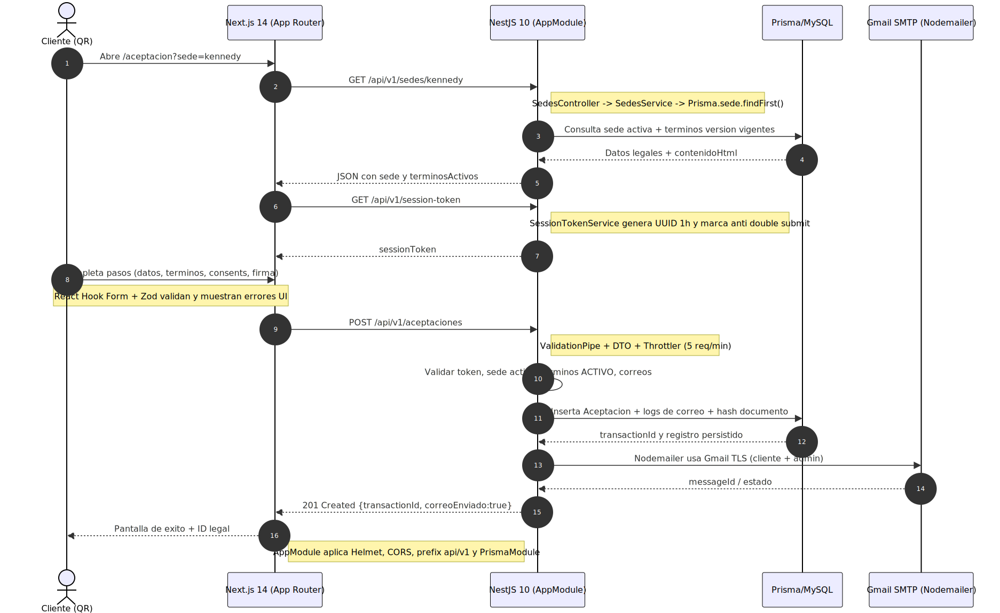
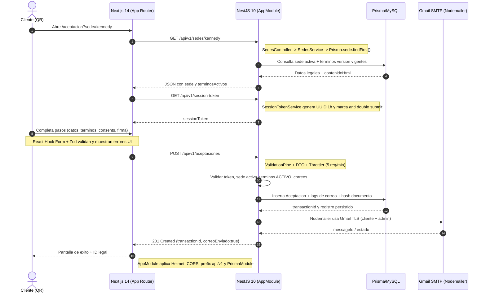

# Diagrama 2: Arquitectura Tecnica

Este diagrama describe la conversacion real entre el frontend Next.js (app router) y la API NestJS levantada en `apps/api/src/main.ts`. Incluye los controladores `SedesController`, `SessionTokenController`, `AceptacionController` y la cadena Prisma/MySQL + Gmail SMTP.

## Resumen tecnico
- `apps/web/lib/api.ts` centraliza las llamadas HTTP (sedes, session-token, aceptaciones) contra `NEXT_PUBLIC_API_URL`.
- `AppModule` aplica `helmet`, CORS cerrado al dominio del frontend y `ValidationPipe` global con sanitizacion de DTOs.
- El Throttler limita los formularios a 5 solicitudes por minuto; `SessionTokenService` genera UUID de 1 hora y marca consumo.
- `AceptacionService` valida sede/terminos, calcula `documentoHashAceptado`, crea logs en `correos_log` y delega a `CorreoService`.

## Imagen renderizada

## Explicacion
1. El celular abre `/aceptacion?sede=kennedy` y la UI consulta `GET /api/v1/sedes/:slug` para mostrar textos legales vigentes.
2. El frontend obtiene `GET /api/v1/session-token` para cada intento y guarda el token en memoria.
3. El usuario completa el wizard; los datos salen via `POST /api/v1/aceptaciones` firmados con el token.
4. `AceptacionController` pasa por `ValidationPipe`, `SessionTokenService`, `SedesService`, `PrismaService` y crea los `correoLog`.
5. `CorreoService` (Nodemailer) negocia TLS con Gmail y envia los dos recibos; la UI recibe `transactionId` y muestra la pantalla de exito.

### Mermaid (referencia editable)

