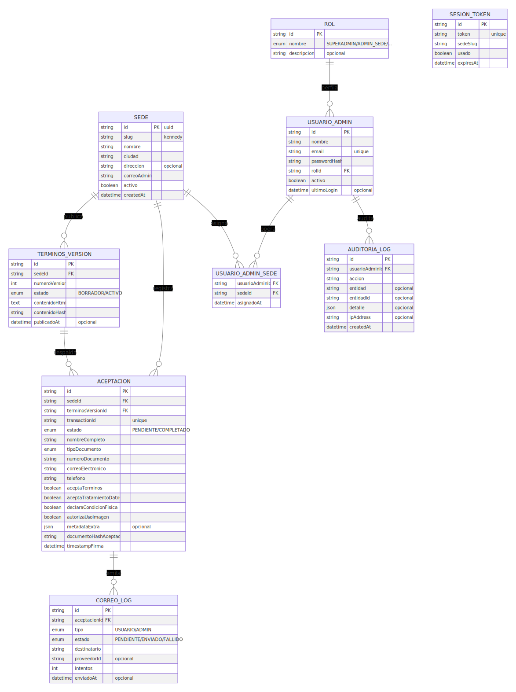
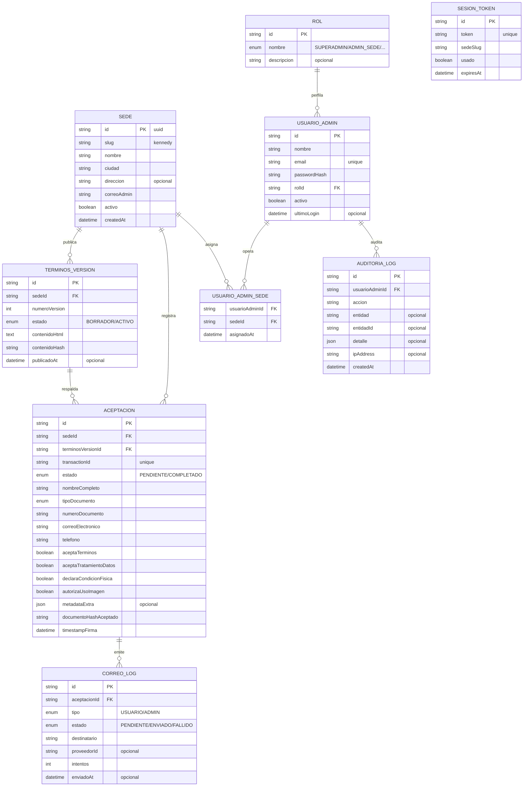

# Diagrama 3: Modelo de Base de Datos

Modelo reflejado en `apps/api/prisma/schema.prisma`. Los contratos legales viven versionados, cada aceptacion captura trazabilidad tecnica y existe auditoria para los usuarios administrativos.

## Resumen del modelo
- `sedes` define la unidad operativa y expone `slug`, contacto y flag `activo`.
- `terminos_versiones` guarda historicos; `aceptaciones` apunta a la version firmada y almacena hashes, consentimientos y metadata tecnica.
- `sesion_tokens` actua como control anti doble submit (token + expiracion + flag `usado`).
- `correos_log` persiste la intencion y resultado de cada correo real.
- `usuarios_admin`, `roles`, `usuarios_admin_sedes` y `auditoria_logs` resguardan operacion interna y trazabilidad legal.

## Imagen renderizada

## Notas clave
1. La inmutabilidad legal viene del par `terminos_versiones` + `aceptaciones.documentoHashAceptado`.
2. `aceptaciones` registra IP, user-agent, consentimientos booleanos y contacto de emergencia, alineado con la Ley 1581.
3. `correos_log` permite reintentos o auditorias de entrega (campos `estado`, `proveedorId`, `intentos`).
4. `auditoria_logs` y `usuarios_admin_sedes` soportan futuras consolas operativas multi-sede sin exponer credenciales en el frontend.

### Mermaid (referencia editable)

